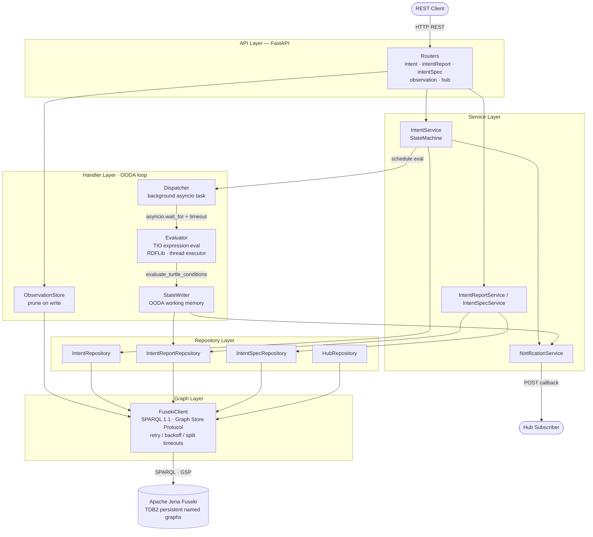

# TMF921 Intent Management API v5.0.0

A implementation of the TM Forum TMF921 Intent Management API built with **Python 3.12 + FastAPI** and **Apache Jena Fuseki** as the authoritative RDF graph store.

---

## Prerequisites

- Docker + Docker Compose **or** Python 3.12 + a running Fuseki instance
- `uv` (optional but recommended for local development)

---

## Quick Start — Docker Compose

```bash
# Start Fuseki and the API
docker compose up --build

# In a second terminal, seed sample data
python seed_data/seed_intents.py

# Verify
curl http://localhost:8000/health
curl http://localhost:8000/tmf-api/intentManagement/v5/intent
```

The Fuseki admin console is available at http://localhost:3030 (user: `admin`, password: `admin`).

---

## Environment Setup

The application reads three environment variables. Copy the template and adjust as needed:

```bash
cp env.template .env
# Edit .env if your Fuseki URL or dataset name differs
```

| Variable | Default | Description |
|---|---|---|
| `FUSEKI_BASE_URL` | `http://localhost:3030` | Fuseki HTTP base URL (no trailing slash) |
| `FUSEKI_DATASET` | `tmf921` | Fuseki dataset name |
| `LOG_LEVEL` | `info` | uvicorn log level |
| `FUSEKI_CONNECT_TIMEOUT` | `5.0` | Fuseki connect timeout in seconds |
| `FUSEKI_READ_TIMEOUT` | `30.0` | Fuseki read timeout in seconds |
| `FUSEKI_MAX_RETRIES` | `3` | Max retries on transient Fuseki errors (502/503/504 + connect errors) |
| `FUSEKI_RETRY_DELAY` | `0.5` | Base retry delay in seconds (exponential backoff + jitter) |
| `EVAL_TIMEOUT_SECONDS` | `30` | Max wall time for a single evaluation cycle before returning Degraded |
| `EVAL_MAX_TURTLE_BYTES` | `524288` | Maximum `expressionValue` size in bytes (512 KB) |
| `MAX_OBS_PER_METRIC` | `10` | Max observations retained per metric per intent |

Pass them on the command line or export from `.env` before starting the server.

---

## Local Development (no containers)

```bash
# Install dependencies
pip install -r requirements.txt
pip install -r requirements-dev.txt

# Start Fuseki only (graph store runs in Docker, app runs on host)
docker compose up fuseki -d

# Wait for Fuseki to be healthy, then start the API
uvicorn src.main:app --reload

# Seed sample data
python seed_data/seed_intents.py
```

---

## Running Tests

```bash
# All tests with coverage
pytest tests/ -v --cov=src --cov-fail-under=80

# Unit tests only
pytest tests/unit/ -v

# Integration tests
pytest tests/integration/ -v

# Contract tests (Schemathesis)
pytest tests/contract/ -v
```

The test suite uses `respx` to mock Fuseki — no running Fuseki required for tests.

---

## API Endpoints

Base path: `/tmf-api/intentManagement/v5`

### Intent

| Method | Path | Description |
|---|---|---|
| `GET` | `/intent` | List intents (pagination: `limit`, `offset`) |
| `POST` | `/intent` | Create intent or ProbeIntent |
| `GET` | `/intent/{id}` | Get intent by ID |
| `PATCH` | `/intent/{id}` | Partial update (RFC 7386 merge patch) |
| `DELETE` | `/intent/{id}` | Delete intent |
| `GET` | `/intent/{id}/intentReport` | List intent reports |
| `GET` | `/intent/{id}/intentReport/{reportId}` | Get intent report by ID |

### IntentSpecification

| Method | Path | Description |
|---|---|---|
| `GET` | `/intentSpecification` | List specifications |
| `POST` | `/intentSpecification` | Create specification |
| `GET` | `/intentSpecification/{id}` | Get specification |
| `PATCH` | `/intentSpecification/{id}` | Update specification |
| `DELETE` | `/intentSpecification/{id}` | Delete specification |

### Event Hub

| Method | Path | Description |
|---|---|---|
| `POST` | `/hub` | Subscribe to events |
| `DELETE` | `/hub/{id}` | Unsubscribe |

### Health

| Method | Path | Description |
|---|---|---|
| `GET` | `/health` | Service + Fuseki health check |

---

## Lifecycle States

```
Acknowledged → Active → Terminated
             ↘ Rejected
```

Valid PATCH transitions are enforced server-side. See `docs/04-state-machine.md` for the full FSM.

---

## Event Types

The API publishes 10 event types to registered hub callbacks:

- `intentCreateEvent`, `intentDeleteEvent`, `intentAttributeValueChangeEvent`, `intentStatusChangeEvent`
- `intentReportCreateEvent`, `intentReportDeleteEvent`, `intentReportAttributeValueChangeEvent`
- `intentSpecificationCreateEvent`, `intentSpecificationDeleteEvent`, `intentSpecificationAttributeValueChangeEvent`, `intentSpecificationStatusChangeEvent`

---

## Architecture

### Component layers



### Named graph layout (Fuseki TDB2)

| Named graph URI | Contents |
|---|---|
| `…/intents/{uuid}` | Intent resource + expression Turtle |
| `…/intentSpecifications/{uuid}` | IntentSpecification resource |
| `…/reports/{uuid}` | IntentReport from last evaluation cycle |
| `…/intents/{uuid}/handlerState` | OODA working memory — per-condition evaluation facts |
| `…/intents/{uuid}/observations` | Metric observations (bounded to `MAX_OBS_PER_METRIC` per metric) |
| `…/hubs` | Hub subscription records |
| `…/ontology` | Loaded TIO/TMF ontology files |

Base prefix: `http://tmforum.org/api/v5`

### Evaluation pipeline

Each write or observation triggers a background evaluation via `Dispatcher → Evaluator → StateWriter`:

```
expressionValue (Turtle)  ──┐
                             ├─► RDFLib Graph ──► pre-processing pipeline
observations Turtle        ──┘                         │
                                    _resolve_metric_refs (single-pass obs index)
                                    _compute_math_functions
                                    _compute_set_constructors
                                    _resolve_validity_chains
                                    _derive_guarantee_states
                                    _derive_ext_types
                                          │
                                    _find_evaluation_roots
                                          │
                              ┌───────────┴────────────┐
                          tree eval               flat-scan fallback
                          (log:allOf/anyOf/…)     (bare quantity nodes)
                                          │
                               {intentHandlingState, reason, conditions[]}
                                          │
                                    StateWriter ──► handlerState graph
                                          │
                                    IntentReport ──► Fuseki
                                          │
                                    NotificationService ──► hub callbacks
```

---

## Postman Collection

Import `postman/TMF921_collection.json` into Postman. Set the `base_url` collection variable to `http://localhost:8000` (default). Set the api_base to `{{base_url}}/tmf-api/intentManagement/v5`.

---

## Linting

```bash
ruff check src/
```

---

## Known Limitations / PoC Assumptions

- **No authentication or authorisation.** All endpoints are open. Add OAuth2/OIDC before any production deployment.
- **No TLS.** The local and Docker Compose setup uses plain HTTP. Terminate TLS at the reverse proxy in production.
- **Fire-and-forget notifications.** Event fan-out to hub callbacks is attempted once; failures are logged and silently dropped. There is no retry queue or dead-letter mechanism.
- **Single Fuseki dataset.** The API is scoped to one dataset (`tmf921`). Multi-tenancy is not supported.
- **Schema init not called at startup.** `schema_init.py` (`ensure_dataset` + `load_ontology`) is not invoked from the FastAPI lifespan. The Docker Compose setup pre-creates the dataset via `FUSEKI_DATASET_1`; the ontology TTL files are not loaded automatically in the container.
- **No pagination link headers.** Pagination is cursor-based (`offset`/`limit`) but `Link` headers (RFC 5988) are not emitted — only `X-Total-Count` and `X-Result-Count`.
- **`expressionValue` is opaque.** The API stores and returns `expressionValue` as a plain string literal. The intent handler loads it into a temporary evaluation graph for reasoning, but the ontology inference is a PoC stub.
