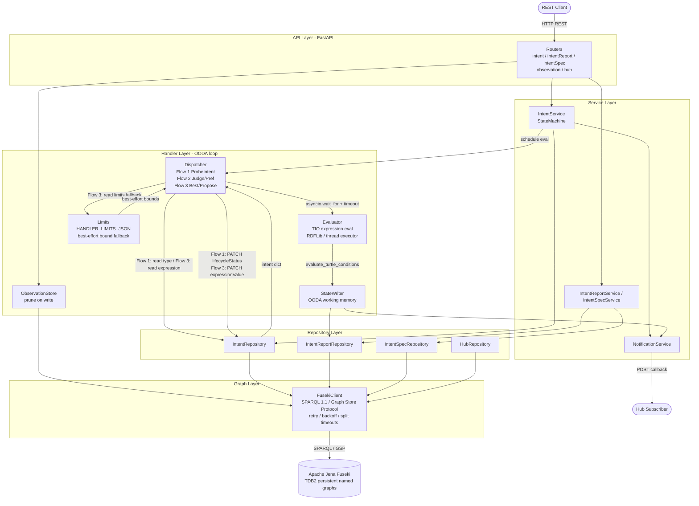

# TMF921 Intent Management API v5.0.0

A implementation of the TM Forum TMF921 Intent Management API built with **Python 3.12 + FastAPI** and **Apache Jena Fuseki** as the authoritative RDF graph store.

---

## Prerequisites

- Docker + Docker Compose **or** Python 3.12 + a running Fuseki instance
- `uv` (optional but recommended for local development)
- TIO ontology TTL files in `ontology/` (see below)

---

## Ontology Files

The `ontology/` directory is **not included in this repository** — the TIO v3.6.0
ontology TTL files must be supplied by the user before starting the server.

At startup the application calls `load_ontology()` which reads every `.ttl` file
from `ontology/` and loads them into the `http://tmforum.org/api/v5/ontology` named
graph in Fuseki. If the directory is absent or empty a warning is logged and startup
continues — the API and evaluation pipeline work without them, but the ontology named
graph in Fuseki will be empty.

**Where to obtain the files:**

Download the TMF921 Intent Management API specification package from the
[TM Forum Open API Table](https://www.tmforum.org/oda/open-apis/table). The ZIP
contains the TIO v3.6.0 ontology TTL files. Extract them into the `ontology/`
directory at the project root.

**Expected files** (TIO v3.6.0):

```
ontology/
  FunctionOntology.ttl
  IntentCommonModel.ttl
  IntentGuaranteeOntology.ttl
  IntentManagementOntology.ttl
  IntentProbing.ttl
  IntentSpecification.ttl
  IntentValidityOntology.ttl
  LogicalOperators.ttl
  MathFunctions.ttl
  MetricsAndObservations.ttl
  PreferenceOfHandlingOutcomes.ttl
  ProposalBestIntent.ttl
  QuantityOntology.ttl
  SetOperators.ttl
  Utility.ttl
  intent.ttl
```

> **Note:** The evaluation pipeline uses hardcoded Python namespace URIs — it does
> not query the ontology named graph at runtime. The TTL files are stored in Fuseki
> for reference and SPARQL tooling only. Evaluation works correctly whether or not
> the files are present.

---

## Quick Start — Docker Compose

Three startup modes are available depending on what you want to run.

### Standalone (single domain)

A single-domain setup on port **8000**. Use this for the `HSI_DEMO.md` walkthrough.

```bash
docker compose --profile standalone up --build

# Seed sample data
python seed_data/seed_intents.py

# Verify
curl http://localhost:8000/health
curl http://localhost:8000/tmf-api/intentManagement/v5/intent
```

### Access Domain (BBF PON resource demo)

Starts the access domain on port **8001**. At startup the server loads the PON
resource inventory (`BBF_access/pon_resource_onto.ttl` +
`BBF_access/pon_resource_data.ttl`) into Fuseki so that intent expressions can
select UNI resources using `set:resourcesOfType` / `set:resourcesWithPropertyObject`.

```bash
docker compose --profile access up --build

# Seed the HSI intent
python seed_data/seed_access.py --base-url http://localhost:8001

# Verify
curl http://localhost:8001/health
```

### Aggregation Domain

Starts the aggregation domain on port **8000**. This domain acts as an intent
owner, posting ProbeIntents and Intents to the access domain via the
TMF921 F-interface.

```bash
docker compose --profile aggregation up --build

# Verify
curl http://localhost:8000/health
```

### Both Domains (F-interface demo)

Runs Fuseki, access domain (:8001), and aggregation domain (:8000) together.
Each domain uses its own Fuseki dataset (`tmf921-access` / `tmf921-agg`).

```bash
docker compose --profile access --profile aggregation up --build

# Run the full F-interface demo (ProbeIntent + HSI intent)
python seed_data/seed_aggregation.py \
    --agg-url  http://localhost:8000 \
    --access-url http://localhost:8001
```

The Fuseki admin console is available at http://localhost:3030 (user: `admin`, password: `admin`) for all startup modes.

---

## Walkthrough Guides

Both guides are fully verified end-to-end.

### HSI_DEMO.md — Single-domain HSI service intent

**Startup:** `docker compose --profile standalone up --build` (port 8000)

A self-contained walkthrough using a synthetic BBF High-Speed Internet (HSI) intent expression. No external resource inventory is required — all structural facts are asserted inline in the expression Turtle.

**What it covers:**

| Step | What happens |
|---|---|
| 1 | Create an HSI intent with a `log:allOf` expression covering delivery, UNI state, and 5 performance conditions |
| 2 | Observe the initial `Degraded` report — performance metric conditions fail with "no observation" |
| 3 | POST 5 metric observations (downstream BW, upstream BW, latency, jitter, packet loss) |
| 4 | Confirm `Fulfilled` — all conditions pass |
| 5 | Spike latency above the threshold → `Degraded` |
| 6 | Post a within-threshold latency observation → self-heals to `Fulfilled` |
| 7 | Force re-evaluation via `PATCH description` (no new observation needed) |
| 8 | Inspect the `handlerState` named graph in Fuseki directly via SPARQL and Graph Store Protocol |
| 9 | **Flow 1 — ProbeIntent:** create a passing and a failing probe; observe auto-transition to `ACTIVE` / `TERMINATED` |
| 10 | **Flow 3 — Best/Propose:** post an intent with an unreachable 500 Mbps bound; handler substitutes the observed 150 Mbps and patches the expression; owner approves → `Fulfilled` |

---

### Access_HSI_Demo.md — Access domain with PON resource inventory

**Startup:** `docker compose --profile access up --build` (port 8001)  
**F-interface (Step 8):** `docker compose --profile access --profile aggregation up --build` (ports 8000 + 8001)

Extends the HSI demo with a real PON network inventory (2 OLTs, 5 ONTs, 10 UNI ports, 7 CTAG allocations). The evaluator resolves TIO set constructors (`set:resourcesOfType`, `set:resourcesWithPropertyObject`) against the live inventory to select a free UNI and CTAG, then writes them back as in-use when the intent is fulfilled.

**What it covers:**

| Step | What happens |
|---|---|
| 1 | Seed the full `hsionlyintent_v0.5.ttl` expression — set-constructor conditions select from the PON inventory |
| 2 | Initial `Degraded` — structural conditions pass (inventory has free resources), performance conditions fail (no observations) |
| 3 | POST 5 metric observations |
| 4 | Confirm `Fulfilled` — all conditions including set-constructor UNI/CTAG selection pass |
| 5 | Query the `resources` named graph in Fuseki — exactly one UNI and one CTAG now show `pon:inUse true` and `pon:assignedToService <intent-uuid>` |
| 6 | Query the `handlerState` graph — `imo:selectedResource` records which UNI and CTAG were chosen |
| 7 | Latency spike → `Degraded`; recovery observation → `Fulfilled` (resources stay reserved throughout) |
| 8 | **F-interface demo:** aggregation domain posts a `ProbeIntent` to the access domain asking "can you deliver ≥ 100 Mbps with a free UNI?"; probe auto-transitions to `ACTIVE`; aggregation domain follows up with the full HSI intent; performance observations drive it to `Fulfilled`; write-back records the allocated UNI |

**PON inventory topology** (abridged):
```
OLT-001  →  UNI-001-1, UNI-001-2, UNI-002-1 (pre-assigned), UNI-002-2, UNI-003-1, UNI-003-2
OLT-002  →  UNI-004-1, UNI-004-2, UNI-005-1 (Down — excluded), UNI-005-2
            CTAG pool: 6 free CTAGs, 1 pre-assigned (CTAG-N-002)
```
The set constructors find 7 free, operationally-up UNIs and 6 free CTAGs; the evaluator selects the first candidate from each pool.

---

## Environment Setup

The application reads three environment variables. Copy the template and adjust as needed:

```bash
cp env.template .env
# Edit .env if your Fuseki URL or dataset name differs
```

| Variable | Default | Description |
|---|---|---|
| `FUSEKI_BASE_URL` | `http://localhost:3030` | Fuseki HTTP base URL (no trailing slash) |
| `FUSEKI_DATASET` | `tmf921` | Fuseki dataset name |
| `LOG_LEVEL` | `info` | uvicorn log level |
| `FUSEKI_CONNECT_TIMEOUT` | `5.0` | Fuseki connect timeout in seconds |
| `FUSEKI_READ_TIMEOUT` | `30.0` | Fuseki read timeout in seconds |
| `FUSEKI_MAX_RETRIES` | `3` | Max retries on transient Fuseki errors (502/503/504 + connect errors) |
| `FUSEKI_RETRY_DELAY` | `0.5` | Base retry delay in seconds (exponential backoff + jitter) |
| `EVAL_TIMEOUT_SECONDS` | `30` | Max wall time for a single evaluation cycle before returning Degraded |
| `EVAL_MAX_TURTLE_BYTES` | `524288` | Maximum `expressionValue` size in bytes (512 KB) |
| `MAX_OBS_PER_METRIC` | `10` | Max observations retained per metric per intent |
| `HANDLER_LIMITS_JSON` | `{}` | JSON object of operator-declared capacity limits used by Flow 3 (Best/Propose) as fallback bounds when no observed value is available. Keys are TIO condition type short names; values are numeric. Example: `'{"quanatLeast": 120.0, "quansmaller": 20.0}'` |
| `RESOURCE_DATA_DIR` | *(unset)* | Path to a directory of `.ttl` files loaded into the `…/resources` named graph at startup. Used by the access domain to load PON resource inventory (`BBF_access`). When unset no resource data is loaded and the resources graph remains empty. |

Pass them on the command line or export from `.env` before starting the server.

---

## Local Development (no containers)

```bash
# Install dependencies
pip install -r requirements.txt
pip install -r requirements-dev.txt

# Start Fuseki only (graph store runs in Docker, app runs on host)
docker compose up fuseki -d

# Wait for Fuseki to be healthy, then start the API (default mode)
uvicorn src.main:app --reload

# Access domain — load PON resource inventory at startup
FUSEKI_DATASET=tmf921-access RESOURCE_DATA_DIR=BBF_access \
    uvicorn src.main:app --port 8001 --reload

# Aggregation domain
FUSEKI_DATASET=tmf921-agg \
    uvicorn src.main:app --port 8000 --reload

# Seed scripts
python seed_data/seed_intents.py                          # default domain
python seed_data/seed_access.py --base-url http://localhost:8001
python seed_data/seed_aggregation.py \
    --agg-url http://localhost:8000 \
    --access-url http://localhost:8001
```

---

## Running Tests

```bash
# All tests with coverage
pytest tests/ -v --cov=src --cov-fail-under=80

# Unit tests only
pytest tests/unit/ -v

# Integration tests
pytest tests/integration/ -v

# Contract tests (Schemathesis)
pytest tests/contract/ -v
```

The test suite uses `respx` to mock Fuseki — no running Fuseki required for tests.

---

## API Endpoints

Base path: `/tmf-api/intentManagement/v5`

### Intent

| Method | Path | Description |
|---|---|---|
| `GET` | `/intent` | List intents (pagination: `limit`, `offset`) |
| `POST` | `/intent` | Create intent or ProbeIntent |
| `GET` | `/intent/{id}` | Get intent by ID |
| `PATCH` | `/intent/{id}` | Partial update (RFC 7386 merge patch) |
| `DELETE` | `/intent/{id}` | Delete intent |
| `GET` | `/intent/{id}/intentReport` | List intent reports |
| `GET` | `/intent/{id}/intentReport/{reportId}` | Get intent report by ID |

### IntentSpecification

| Method | Path | Description |
|---|---|---|
| `GET` | `/intentSpecification` | List specifications |
| `POST` | `/intentSpecification` | Create specification |
| `GET` | `/intentSpecification/{id}` | Get specification |
| `PATCH` | `/intentSpecification/{id}` | Update specification |
| `DELETE` | `/intentSpecification/{id}` | Delete specification |

### Event Hub

| Method | Path | Description |
|---|---|---|
| `POST` | `/hub` | Subscribe to events |
| `DELETE` | `/hub/{id}` | Unsubscribe |

### Health

| Method | Path | Description |
|---|---|---|
| `GET` | `/health` | Service + Fuseki health check |

---

## Lifecycle States

```
Acknowledged → Active → Terminated
             ↘ Rejected
```

Valid PATCH transitions are enforced server-side. See `docs/04-state-machine.md` for the full FSM.

---

## Negotiation Flows

The handler dispatcher implements all three TMF921A §4.2 negotiation flows automatically as background tasks after each evaluation. No special endpoints are required — all interactions use standard `POST /intent` and `PATCH /intent/{id}`.

### Flow 1 — ProbeIntent (capability probe)

The owner asks "can you satisfy these terms?" by creating a `ProbeIntent` that references the parent via `intentRelationship`. The handler evaluates the ProbeIntent's expression and auto-transitions it:

- **Fulfilled → `ACTIVE`** — the handler can satisfy the expressed terms
- **Degraded → `TERMINATED`** — the handler cannot satisfy the terms

```
1. Owner   POST /intent  (@type: ProbeIntent, intentRelationship → parent id)
2. Handler evaluates expression → PATCH lifecycleStatus ACTIVE or TERMINATED
3. Owner   reads result via GET /intent/{probeId} or intentStatusChangeEvent
```

**What you must include in the POST body:**

| Field | Required | Notes |
|---|---|---|
| `@type` | Yes | Must be `"ProbeIntent"` — not `"Intent"` |
| `intentRelationship[].id` | Yes | UUID of the parent Intent this probe relates to |
| `intentRelationship[].relationshipType` | Yes | `"relatesTo"` |
| `expression.@type` | Yes | Must be `"TurtleExpression"` — a `JsonLdExpression` cannot be evaluated and will always result in `TERMINATED` |
| `expression.expressionValue` | Yes | Turtle string expressing the terms you are probing |

The ProbeIntent's expression is evaluated **independently** — it does not inherit the parent intent's observations. If your probe expression references metric URIs, post observations against the ProbeIntent's own ID to provide values.

### Flow 2 — Judge/Preference (owner adjusts degraded intent)

When conditions degrade and the owner patches new preference values, the handler re-evaluates and auto-transitions back to `ACTIVE` if the revised expression passes. See `docs/06-negotiation.md`.

### Flow 3 — Best/Propose (handler proposes achievable bounds)

When a `TurtleExpression` intent evaluates as `Degraded`, the handler substitutes best-effort bound values into the expression and patches the intent, then waits for owner approval:

```
1. Owner   POST /intent  (TurtleExpression with desired bounds — your "ask")
2. Handler evaluates → Degraded → PATCH expressionValue with best-effort bounds
           fires intentAttributeValueChangeEvent
3. Owner   GET /intent/{id} to inspect the proposed bounds
           PATCH lifecycleStatus ACTIVE to accept, or TERMINATED to reject
```

**Roles — who sets what:**

| Who | What they set | When |
|---|---|---|
| **Owner** | The desired (strict) bounds in the `expressionValue` Turtle | At `POST /intent` time |
| **Handler** | The achievable (relaxed) bounds substituted back into the expression | Automatically after Degraded evaluation |
| **Operator** | `HANDLER_LIMITS_JSON` — declared capacity used as a fallback | At server startup via environment variable |

**Best-effort bound selection (per failed condition, in priority order):**
1. **Observed value** from the last evaluation cycle — the value the system actually measured
2. **`HANDLER_LIMITS_JSON[condition_type]`** — operator-declared capacity limit (used when no observation exists)
3. **No substitution** — if neither is available for a condition, that condition is left unchanged and no PATCH is made

**`HANDLER_LIMITS_JSON` key names** map to TIO quantity condition type short names:

| Key | Condition | Meaning |
|---|---|---|
| `"quanatLeast"` or `"atLeast"` | `quan:quanatLeast` / `quan:atLeast` | Minimum threshold (`≥`) |
| `"quanatMost"` or `"atMost"` | `quan:quanatMost` / `quan:atMost` | Maximum threshold (`≤`) |
| `"quangreater"` or `"greater"` | `quan:quangreater` / `quan:greater` | Strict minimum (`>`) |
| `"quansmaller"` or `"smaller"` | `quan:quansmaller` / `quan:smaller` | Strict maximum (`<`) |
| `"quanexactly"` or `"exactly"` | `quan:quanexactly` / `quan:exactly` | Exact value (`==`) |

Flow 3 only applies to `TurtleExpression` intents in `ACKNOWLEDGED` or `ACTIVE` state — `JsonLdExpression` content is opaque and is never modified.

---

## Event Types

The API publishes 10 event types to registered hub callbacks:

- `intentCreateEvent`, `intentDeleteEvent`, `intentAttributeValueChangeEvent`, `intentStatusChangeEvent`
- `intentReportCreateEvent`, `intentReportDeleteEvent`, `intentReportAttributeValueChangeEvent`
- `intentSpecificationCreateEvent`, `intentSpecificationDeleteEvent`, `intentSpecificationAttributeValueChangeEvent`, `intentSpecificationStatusChangeEvent`

---

## Architecture

### Component layers



### Named graph layout (Fuseki TDB2)

| Named graph URI | Contents |
|---|---|
| `…/intents/{uuid}` | Intent resource + expression Turtle |
| `…/intentSpecifications/{uuid}` | IntentSpecification resource |
| `…/reports/{uuid}` | IntentReport from last evaluation cycle |
| `…/intents/{uuid}/handlerState` | OODA working memory — per-condition evaluation facts |
| `…/intents/{uuid}/observations` | Metric observations (bounded to `MAX_OBS_PER_METRIC` per metric) |
| `…/hubs` | Hub subscription records |
| `…/ontology` | Loaded TIO/TMF ontology files |

Base prefix: `http://tmforum.org/api/v5`

### Evaluation pipeline

Each write or observation triggers a background evaluation via `Dispatcher → Evaluator → StateWriter`:

```
expressionValue (Turtle)  ──┐
                             ├─► RDFLib Graph ──► pre-processing pipeline
observations Turtle        ──┘                         │
                                    _resolve_metric_refs (single-pass obs index)
                                    _compute_math_functions
                                    _compute_set_constructors
                                    _resolve_validity_chains
                                    _derive_guarantee_states
                                    _derive_ext_types
                                          │
                                    _find_evaluation_roots
                                          │
                              ┌───────────┴────────────┐
                          tree eval               flat-scan fallback
                          (log:allOf/anyOf/…)     (bare quantity nodes)
                                          │
                               {intentHandlingState, reason, conditions[]}
                                          │
                                    StateWriter ──► handlerState graph
                                          │
                                    IntentReport ──► Fuseki
                                          │
                                    NotificationService ──► hub callbacks
                                          │
                            ┌─────────────┴──────────────┐
                       Fulfilled                      Degraded
                            │                             │
               Flow 1 ProbeIntent → ACTIVE    Flow 1 ProbeIntent → TERMINATED
               Flow 2 Judge/Pref  → ACTIVE    Flow 3 Best/Propose → PATCH expressionValue
                                                          │
                                              Limits (HANDLER_LIMITS_JSON fallback)
```

---

## Postman Collection

Import `postman/TMF921_collection.json` into Postman. Set the `base_url` collection variable to `http://localhost:8000` (default). Set the api_base to `{{base_url}}/tmf-api/intentManagement/v5`.

---

## Linting

```bash
ruff check src/
```

---

## Known Limitations / PoC Assumptions

- **No authentication or authorisation.** All endpoints are open. Add OAuth2/OIDC before any production deployment.
- **No TLS.** The local and Docker Compose setup uses plain HTTP. Terminate TLS at the reverse proxy in production.
- **Fire-and-forget notifications.** Event fan-out to hub callbacks is attempted once; failures are logged and silently dropped. There is no retry queue or dead-letter mechanism.
- **Single Fuseki dataset.** The API is scoped to one dataset (`tmf921`). Multi-tenancy is not supported.
- **Ontology load is best-effort.** `schema_init.py` (`ensure_dataset` + `load_ontology`) is called from the FastAPI lifespan but errors are caught and logged as warnings — if Fuseki is not reachable at startup, or the `ontology/` directory is absent, the server starts anyway. The Docker Compose setup pre-creates the dataset via `FUSEKI_DATASET_1`; place TTL files in `ontology/` before starting if you want the ontology named graph populated.
- **No pagination link headers.** Pagination is cursor-based (`offset`/`limit`) but `Link` headers (RFC 5988) are not emitted — only `X-Total-Count` and `X-Result-Count`.
- **`expressionValue` mutation limited to two-argument quantity conditions.** Flow 3 (Best/Propose) updates `rdf:value` literals on `quan:quanat*` / `quan:at*` bound nodes. Complex expressions using set operators, math functions, or validity chains are stored back as-is; only the quantity bounds are substituted. `JsonLdExpression` content is never modified.
